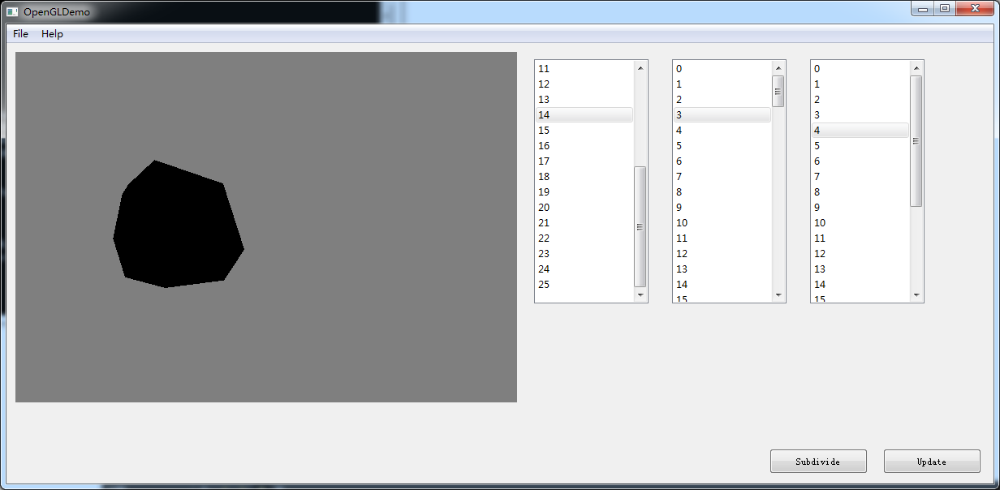

# CIS_560_HW6

## Q&A

Q: (5 pts) When quadrangulating a face during Catmull-Clark subdivision, what information must you temporarily store in order to properly link your half-edge pointers without creating inaccessible edges?
			
A: When quadangulate, we need to store: 
1. a vector of pointers which points to original faces
2. a vector of pointers which points to all the cendroids we added
3. a vector of pointers points to all the mid-points we added
4. new faces we added
5. a map of ( (midpoints, cendroid), new faces)

Q: (5 pts) When extruding a face, what operation must be performed after all edges have been turned into quadrangles? What is an edge case in the scope of this operation?
			
A: Face: all new half edges' sym should be connecting to neighbors(if there is).
Edge: all new half edges' sym hald edges' face should be NULL. 

## Features:

After loaded the object, the list is empty. 

#### Click "Update" button to update the 3 lists. 

Click any item to view its information. 

Vertex: position.

Half Edges: which vertex it points to. 

Faces: which half edge it starts at. 

#### Click "Subdivide" to subdivide the mesh.

After that, you may click "Update" again to update the list(Since it changed!)

Most of the functions are implemented under halfedge.cpp, which I apologyse to make it so big...

### 1. addVertex(int), takes the ID of a half-edge, add a vertex in the middle of it. 

This function also returns the pointer to the new vertex.

### 2. triangulate(int), take the ID of a face, triangluate it. 

### 3. subdivision(), takes in nothing, and subdivide the mesh. 

### 4. quadranglate(Face *, Vertex *, std::vector<int>), a function called by subdivision. 

After we computed all the mid points and moved original points, call this function to add faces and half-edges.

## Bugs: 

1. Qt UI not working well, and OpenGL selection is still not working. The original GL::Draw seems not working anymore. 

2. The subdivision of the cube is not right, one vertex is in wrong position. I checked many times and still can not find the error. 

## Without highlights, how did I do the debugging? 

Well the procedure is somewhat traditionally painful, I implemented a function in mainwindow.cpp. When you clicked any item(eg. vertex, edge, face), it will show some information. That's how I did the debugging. 
